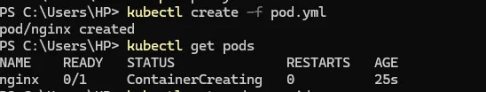
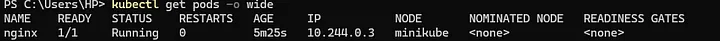
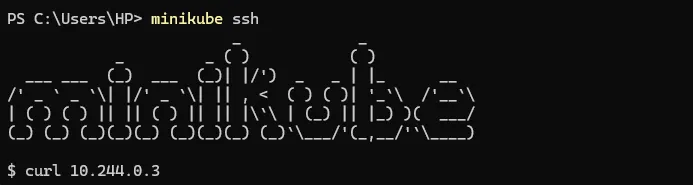
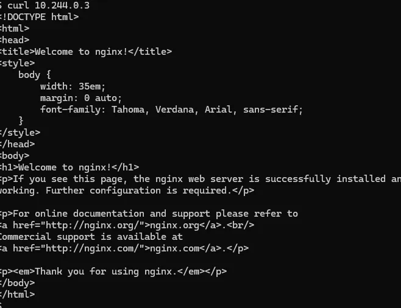

# Deploying Kubernetes Pod with Minikube on Windows

This guide provides step-by-step instructions on deploying a Kubernetes pod using Minikube on Windows. The configuration files and images included in this folder are based on the original blog post by [Ayesha Ayman](https://medium.com/@ayeshaayman789/deploying-kubernetes-pod-with-minikube-on-windows-64db889d1c8a).

---

## Prerequisites

- Windows OS
- Minikube installed
- kubectl installed

For installation instructions, refer to the official documentation:
- [Minikube Installation](https://minikube.sigs.k8s.io/docs/start/)
- [kubectl Installation](https://kubernetes.io/docs/tasks/tools/)

---

## Steps to Deploy a Kubernetes Pod

### 1. Start Minikube

Run the following command to start Minikube:
```bash
minikube start
```
### 2.Create a YAML Configuration File for the Pod
Create file named pod.yaml that contains the configuration for deploying a sample NGINX pod.
-[pod.yml](./pod.yml) that contains the configuration for deploying a sample NGINX pod.
### 3.Create a Pod
This command reads the pod.yml file, which contains the configuration for a pod, and creates that pod in the Kubernetes cluster.
```bash
kubectl create -f pod.yml
```


### 4.Verify the Pod Status
Check if the pod is running with:
```bash
kubectl get pods
```


### 5. Login to kubernetes cluster

```bash
minikube ssh
```

- curl <ip>: After SSH-ing into the Minikube VM, you can use curl to make HTTP requests to any services running within Minikube.

